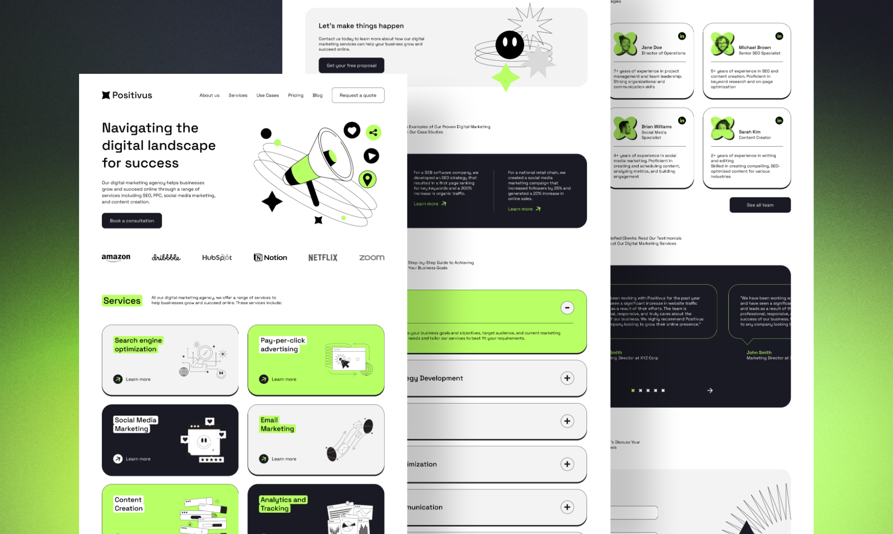

# Positivus

## Table of Contents
- [Objective](#objective)
- [Figma Design](#figma-design)
- [Built With](#built-with)
- [Author](#author)
- [Deployment](#deployment)
- [Reflection](#reflection)

## Objective

It's been a while since I last had to develop a website based on a Figma design. The last time was during my internship last summer. For most of my projects, I usually skip creating a Figma design and instead start developing the sites right away, using layouts from other sites I found interesting at the time. This is why I wanted to polish my skills by coding based on a Figma design created by someone else, mimicking how a client would ask me to build a website for them.

## Figma Design

Link to the Figma design I'll be using to develop the website can be found [here](https://www.figma.com/design/2SnI4Pweiuh4yUQnwjvgmq/Positivus-Landing-Page-Design-(Community)). You can compare the design to the website I developed [here](https://positivus-phot.vercel.app/).

This design is the first one I found after searching for free website designs on Google.

It was illustrated by Igor Kapustin; credits to him.

## Built With
- Vite
- ReactTS
- Tailwind CSS
- SwiperJS

## Author

Phot Koseekrainiramon (Developer)
- [LinkedIn](https://www.linkedin.com/in/phot-kosee/)
- [GitHub](https://github.com/photkosee)

Igor Kapustin (UX/UI Designer)

## Deployment

This project is deployed to Vercel:

https://positivus-phot.vercel.app/

## Reflection

I've gotten faster at development compared to my performance during my internship last summer (2023). This really makes me want to go back and rework those projects I did. To be fair, that was when I first got introduced to TailwindCSS, and now I can’t stop using it.

I had the chance to try out some new approaches, like using `grid` instead of `flexbox` in certain cases. My younger self would always default to `flexbox`, then duplicate components and use `hidden` on one or the other when the layouts got too complex, especially when components were under different parents making it impossible to `order` them (if you know what I mean). Using `hidden` still causes the component to be downloaded, which isn't optimal. It’s better to avoid it if possible. Of course, there are no absolute solutions—you can always tweak things, whether by using `absolute` positioning or other tricks. I just enjoy trying new things to be a little more creative next time.

The most enjoyable part was customizing the SwiperJS component to mimic the design of a slider in the Testimonials Section. Although I used SwiperJS to create carousels in both the Case Studies and Testimonials sections, the first one was straightforward, unlike the latter. You can check out how I developed these in the `src/components/carousels` directory. Next time, I might write some comments on those chunks of code to prevent confusion for others unfamiliar with the library—and to help my future self when I revisit it.
